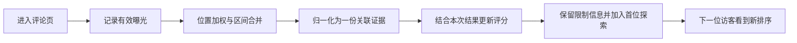

# 算法原理

这个项目研究商品详情页里的评论排序。输入是评论在页面中的可见位置、可见时长，以及随后得到的购买结果；输出是下一次进入评论页时的推荐顺序。

这里的核心问题是：怎样从这些不完整的行为信号里提取有限的排序依据，同时给产品限制、冷评论和未购买的情况留出位置。当前实现是可交互的合成演示，还没有真实用户实验结果。

## 从一次浏览到下一次排序

每位访客有独立的浏览片段。同一轮中，前一位已经结算的反馈会传给后一位；正在浏览时不会突然把列表按新分数重新排列。

## 1. 可见不等于看过

页面每 250 毫秒检查一次评论与视窗的交集。一段曝光要同时满足：

- 页面在前台，评论列表已完成进入和激活。
- 评论至少 50% 可见，且连续可见至少 1 秒。
- 全文弹层、后台、失焦及页面过渡期间不计入列表曝光。

位置与可见比例分别计算。`center_y` 是完整评论行的中心，相对手机评论视窗归一化后的位置；`visible_fraction` 根据评论、评论视窗和浏览器可见区的实际交集计算。因此，把外层页面滚到研究台不会让评论重新获得一个“更靠中间”的位置。

界面里的“可见时长（评论合计）”是多条评论的可见时间之和。8 条评论同时可见 5 秒，合计可以接近 40 秒。这个展示计数不等于页面停留时长，也不直接等于用于评分的加权时长；评分前还会做有效性筛选、去重和截断。

这些指标只能说明评论有机会被看到。它们不能判断注视、理解、赞同，更不能判断哪句话说服了用户。

## 2. 三种位置权重

八行评论用于直观展示权重。下表按评论视窗从上到下排列，数值是界面显示的 1–8 尺度；计算时统一除以 8。

| 位置 | 均匀 `uniform` | A：下方递增 `slide` | B：中下区域 `center_lower` |
| ---: | ---: | ---: | ---: |
| 1 | 8 | 1 | 1 |
| 2 | 8 | 2 | 3 |
| 3 | 8 | 3 | 5 |
| 4 | 8 | 4 | 7 |
| 5 | 8 | 5 | 8 |
| 6 | 8 | 6 | 8 |
| 7 | 8 | 7 | 7 |
| 8 | 8 | 8 | 5 |

未发生滑动的首屏，三种策略都使用全 8，也就是计算权重全为 1。发生滑动后，才使用各自的位置函数；滑回顶部也不会恢复为“未滑动首屏”。

令位置为 $y\in[0,1]$，A 的连续函数为：

$$
g_A(y)=\frac{\min(8,\max(1,8y+0.5))}{8}
$$

B 在八个行中心 $y_r=(r-0.5)/8$ 取表中数值，再做分段线性插值，超出两端行中心时使用端点值。均匀策略始终为 $g_U(y)=1$。

A 固定让视窗下方权重更高，没有根据手势方向切换高权重端。B 在第 5、6 行中心达到最大值。两者都是待比较的位置假设；默认展示 B 只是为了让变化易于观察，不表示已证实中下区域更受关注。这里的 A、B 是两种权重方案的名字，不代表已经做过线上 A/B 实验。

## 3. 把一次结果分成一份证据

对浏览片段 $i$ 和评论 $j$，先把有效曝光裁剪到片段开始后、24 小时内；如果期间购买，再截断到购买时刻。裁剪后仍需满足有效曝光阈值。

同一评论的重叠区间取时间并集，重叠处使用最大的已观测权重，只计算一次。累计取前 30 秒有效可见时间，随后不再增长。这个上限按合并后的可见时间计算，发生在位置加权之前。

设合并得到的小区间为 $s$，长度为 $\Delta t_s$，其中活跃曝光段为 $E_s$。加权量为：

$$
a_{ij}=\sum_s\Delta t_s\max_{e\in E_s}\left[v_e\,g(y_e)\right]
$$

其中 $v_e$ 是该曝光段的可见比例，$y_e$ 是位置。浏览器将段内采样的可见比例和位置取平均后传入计算；它不是逐帧精确的注意力积分。

再把同一片段所有评论的加权量归一化：

$$
q_{ij}=\frac{a_{ij}}{\sum_k a_{ik}}
$$

例如，两条评论得到 3 和 1 个加权秒，分到的份额就是 0.75 和 0.25。只要分母大于 0，一次结果分出的总份额就是 1；浏览更多评论不会凭空生成更多购买样本。如果没有有效曝光，结果仍会进入轮次总结，但不改变任何评论分数。

`q` 表示分配给评论的弱关联份额。它不是这条评论的付款概率，也不是因果贡献。未曝光评论的份额为 0，不会因为没有被看到而受到惩罚。

## 4. 用成熟结果更新平滑分数

Python 核心区分支付结果和净购买结果：

| 结果 | 时间与处理 |
| --- | --- |
| 24 小时内支付 | 从片段开始满 26 小时后，支付标签才进入成熟队列；前 24 小时是购买窗口，额外 2 小时留给延迟数据。 |
| 窗口内未支付 | 同样等待 26 小时，之后标为 0；此前保持待定。 |
| 已支付且未退款 | 等到支付后 30 天加 2 小时，并明确知道未退款，净购买标签才为 1。 |
| 退款状态未知 | 净购买标签保持待定，不按成功处理。 |
| 已退款 | 净购买标签成熟后为 0。 |

排序更新使用净购买标签 $Y_i$。网页通过“已支付”“未购买”“购买后退款”三个按钮给出合成结果，并直接按观察窗口已经结束来结算，方便在几分钟内走完演示；它没有查询真实订单。

每条评论累计正、负两类关联量：

$$
P_j=\sum_i q_{ij}Y_i,\qquad N_j=\sum_i q_{ij}(1-Y_i)
$$

用质量先验 $\pi_j$ 做平滑：

$$
h_j=\frac{\pi_j+P_j}{1+P_j+N_j}
$$

这相当于从总强度为 1 的先验伪计数出发，再加入分数形式的观测份额。没有观测时，$h_j=\pi_j$；一次偶然购买不会直接得到满分。样例中的先验是人工设置的示意值，并未由质量模型学习或用真实数据校准。

最终用于基础排序的分数是：

$$
S_j=0.7\pi_j+0.3h_j
$$

行为关联只占 30%。例如，两条评论的先验均为 0.70，按上面的 0.75、0.25 分到一次净购买结果后，推荐评分约为 0.739、0.718。分数会有所变化，但不会把一次支付变成无限奖励。网页中的每个片段只能结算一次；Python 核心还支持替换旧结算，先撤掉旧份额再应用新份额，避免重复记账。

0.7/0.3、1 秒、30 秒和各个时间窗口都是当前工程参数，没有经过业务效果调优。$h_j$ 和 $S_j$ 都不应作为校准后的购买概率使用。

## 5. 分数之外的排序规则

推荐顺序还包含两步处理，所以它不总是严格按 $S_j$ 从高到低排列。

首先，只保留有资格展示的候选评论，按推荐分数降序排列，同分按评论 ID 排序。候选不止一条，且其中存在 `risk >= 0.5` 的评论时，将基线顺序中第一条满足条件的评论放到第 2 位。这里的 `risk` 是对具体产品限制信息的示意标记，不是欺诈概率。它可以出现在中性评论中，也不等于把所有负面评论都放到前面。

接着加入首位探索：以 $1-\varepsilon$ 的概率选择基线首条，以 $\varepsilon$ 的概率从全部合格候选中等概率选择一条放到首位。默认 $\varepsilon=0.10$；其余评论保留基线相对顺序。

候选数量为 $K$ 时，某条评论 $a$ 被选到首位的概率是：

$$
p(a)=(1-\varepsilon)\mathbf{1}[a=b_1]+\frac{\varepsilon}{K}
$$

其中 $b_1$ 是调整后的基线首条。72 条候选全部有资格时，基线首条概率约为 90.139%，其他每条约为 0.139%；只有一条候选时，其概率为 1。限制信息的前置发生在抽样前，经首位探索后，所保留的那条限制信息仍在前三位。

首位探索给其他评论一次被优先看到的机会，并记录实际选中动作的混合概率。它没有消除所有位置偏差，也不支持把任意完整重排都当成同一个动作来评价。用户主动选择最新排序或评价筛选后，看到的列表也不能继续解释成未经改动的随机推荐列表。

## 网页演示的边界

演示包含 72 条合成评论：26 条正面、26 条负面、20 条中性；每轮 6 位合成访客。首次进入评论页后锁定本轮位置策略。选择结果后更新评分并切换下一位，六位完成后显示总结。返回商品页保留本轮进度；停止或开始新一轮会恢复初始数据。

公开网页在当前标签页内运行仿真，阅读记录与结果只保留在该页面的内存中。刷新或关闭页面后重新开始，也不会把不同浏览者的操作汇成一个共享模型。Python 版本提供相同计算规则的参考实现，适合进一步阅读和本地研究。

对应源码：[曝光采样与界面](../web/app.js)、[浏览器仿真引擎](../web/demo-engine.js)、[Python 排序核心](../src/comment_ranker.py)、[合成评论](../src/sample_data.py)。

目前仍有几项明确不足：

- **缺少真实效果证据。** 六位访客用于展示流程，不是统计样本。默认位置权重、评分系数及先验不能视为最优参数。
- **关联和有用性之间有距离。** 价格、已有购买意愿、其他页面信息都可能影响结果；一条准确的差评促成不购买，也可能帮助用户做出了更好的决定。把未购买记为负关联无法完整衡量这种价值。
- **测量比较粗。** 列表可见性替代不了注意力，全文阅读没有单独归因，固定八行界面也不能代表所有设备与评论样式。
- **排序约束有限。** 当前只保留一条限制信息，没有完整的主题覆盖、个性化、时间衰减或评论真实性判断。
- **演示不承担交易和训练服务。** 没有真实身份、可信订单回流、跨设备片段管理、持久多用户训练或抗刷量系统。

下一步有价值的验证，是在固定页面与商品条件下，对均匀权重和候选位置策略进行预先设定的随机比较，同时观察决策帮助度、净购买、退款和信息完整性。只看停留变长或短期付款增加，无法回答评论排序是否真正帮到了用户。
